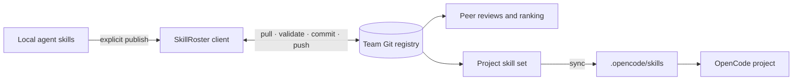

<p align="center">
  
</p>

<p align="center">
  <a href="./README.md">한국어</a> · <strong>English</strong>
</p>

<p align="center">
  <a href="https://github.com/orqan137/skillroster/actions/workflows/ci.yml"></a>
  
  
  
  
</p>

> A self-hosted, Git-native team registry for publishing AI agent skills, reviewing them with teammates, and assembling project-ready skill sets.

SkillRoster does not collect every local file or prompt into a central service. It stores only explicitly published `SKILL.md` files, user-selected attachments and reference locations, team reviews, project skill sets, and minimal execution records in an ordinary Git repository. Each teammate works from their own clone, while OpenCode consumes selected skills directly from `.opencode/skills/`.

<p align="center">
  
</p>

## The problem

AI coding skills usually stay scattered across individual machines. Even when a skill looks useful, a team cannot easily tell where it worked, whether it is still current, or which exact version a project adopted. A shared file server loses provenance; a public marketplace's download count says little about a private team's environment.

| Team question | SkillRoster answer |
|---|---|
| Which skills do we actually use? | Browse skills and immutable versions that teammates chose to publish. |
| Which skill should a project adopt? | Compare peer reviews, author self-reviews, project adoption, and execution evidence separately. |
| What fits a new project? | Combine detected technology tags with the team's evidence-weighted ranking. |
| Who changed this knowledge? | Trace YAML and Markdown through Git commits, diffs, and blame. |
| Are source code and prompts uploaded? | No by default. Only `SKILL.md`, explicitly selected attachments, and reference locations are shared. |

## Real product screens

These are full 1440×900 captures from the actual `pnpm demo` Git registry, not design mockups.

<p align="center">
  
</p>

<p align="center">
  
</p>

<table>
  <tr>
    <td width="50%"></td>
    <td width="50%"></td>
  </tr>
  <tr>
    <td><b>Shared versus local</b><br>See what stays on this machine and what the team can reuse.</td>
    <td><b>Project recommendations</b><br>Select exact skill versions using tag fit and team ranking.</td>
  </tr>
</table>

<p align="center">
  
</p>

## How it works



Start a roster with one empty remote repository. Teammates use the repository's existing access control and their own clones. The local React dashboard reads and writes the Git documents without a separate database. Reads use the local clone immediately; Settings provides an explicit `Pull Git changes` action. Every review, skill, or project mutation waits for pull, full-registry validation, commit, and push before reporting success.

## What makes it different

- **Team context, not marketplace popularity:** rankings reflect your team's reviews, recent usage, and project adoption.
- **Git is the database:** reviews, evidence, and project loadouts remain inspectable, diffable, and reversible.
- **Reviews plus evidence:** a five-star score is not treated as proof. The UI separates opinions from recorded project outcomes.
- **Honest self-review:** authors may evaluate their own skill, but the UI marks it as an author review and applies a lower ranking weight.
- **Versioned project loadouts:** projects adopt an exact skill version and sync it into OpenCode.
- **Project Git integration:** creating a project links its own Git repository and commits the selected roster to `.skillroster/project.yaml`.
- **Explicit reference scope:** links and paths remain location-only by default; a file is copied only when the user deliberately selects “include file.”
- **Private by default:** the public schema rejects prompt or source payloads in execution evidence.
- **Tool-readable format:** Markdown, YAML, and JSON Schema are usable beyond OpenCode.

## Two-minute demo

Requirements: Node.js 22+, pnpm 11+, and Git.

```bash
corepack enable
pnpm install
pnpm demo
```

The demo creates a temporary local Git registry with three members, three skills, two projects, four reviews, and two execution records. It opens at `http://127.0.0.1:3211`, uses only its isolated settings and `examples/skills`, and does not scan the user's real agent skills or require remote credentials.

To configure your own roster instead:

```bash
corepack enable
pnpm install
pnpm dev
```

Open `http://127.0.0.1:3210`, then choose one path:

- **Create a new roster:** connect an empty GitHub, GitLab, Gitea, or internal Git repository. SkillRoster creates the registry structure and pushes the first commit.
- **Join an existing roster:** connect a repository initialized by a teammate. SkillRoster clones it and commits your member record.

Both flows require clone and push access. SkillRoster never stores a Git password or token. It reuses Git Credential Manager on Windows, Keychain on macOS, or the user's SSH agent, and checks write access with a non-mutating `git push --dry-run`.

Default local discovery paths:

| Agent | Default path |
|---|---|
| Codex | `~/.codex/skills` |
| OpenCode | `~/.config/opencode/skills` |
| Claude Code | `~/.claude/skills` |
| Agent Skills | `~/.agents/skills` |

The scanner looks for `SKILL.md` up to four levels below a selected directory. It reads name and description metadata only. Publishing includes `SKILL.md` by default; optional references may stay location-only or include an explicitly selected safe file. Neighboring files and folders are never copied automatically.

## CLI workflow

```bash
# Team lead: initialize an empty remote
pnpm skillroster team init \
  --name backend \
  --display-name "Backend Guild" \
  --owner hong \
  --remote git@github.com:your-org/backend-skillroster.git

# Teammate: join the same registry
pnpm skillroster team join git@github.com:your-org/backend-skillroster.git \
  --member kim \
  --display-name "Kim"

# Publish and assemble a project loadout
pnpm skillroster publish ./my-skill --version 1.0.0 --tags typescript,api
cd my-project
pnpm --dir ../skill-roster skillroster project init --name checkout-api
pnpm --dir ../skill-roster skillroster project add hong/api-contract-check
pnpm --dir ../skill-roster skillroster sync
```

`project init` installs an OpenCode event plugin, a preservation-aware Git `post-commit` hook, and `.skillspace/project.yaml`. `sync` then installs the selected immutable versions into `.opencode/skills/`.

| Command | Purpose |
|---|---|
| `team init` / `team join` | Create or join a Git-backed roster. |
| `publish` | Publish a local skill and immutable version snapshot. |
| `review` | Review a specific skill version. |
| `project init` / `project add` | Register a project and build its skill set. |
| `sync` | Install the project skill set into `.opencode/skills`. |
| `evidence flush` | Validate queued usage events and commit them to Git. |
| `rank` | Print the evidence-weighted team ranking. |
| `dashboard` / `demo` | Open the real registry dashboard or a temporary demo. |

Use `pnpm skillroster <command> --help` for all options.

## Ranking and privacy boundary

When OpenCode loads an installed skill, the local queue records only the skill and version, session identifier, timestamp, and explicit `promptStored: false` / `sourceStored: false` flags. The next Git commit runs the project's configured verification command and records `verified`, `failed`, or `used`. A failed verification does not block the developer's commit.

Ranking combines a Bayesian peer rating (65%), execution records (20%), recency (10%), and project adoption. Author reviews have a lower weight, missing peer reviews or execution records do not receive free points, and the prior mean prevents a brand-new skill with a single rating from immediately taking first place.

## Cross-platform and Docker

The source client runs the same way on Windows, macOS, and Linux. Paths are resolved through Node.js OS APIs rather than hard-coded home directories. The current MVP is a developer-oriented source distribution; an `npx skillroster` package and standalone binaries remain roadmap items.

The Docker dashboard binds to localhost by default:

```bash
export SKILLSPACE_REGISTRY_HOST=/absolute/path/to/your/team-clone
export SKILLSPACE_MEMBER=kim
docker compose up --build
```

## Repository map

```text
apps/cli                  Team, publish, review, project, and dashboard CLI
apps/web                  React + Vite dashboard and Git write API
packages/core             File repository, detection, recommendation, ranking
packages/git              Clone/pull/commit/rebase/push transactions
packages/opencode-plugin  OpenCode plugin and preservation-aware Git hook
packages/schemas          Public TypeScript types and JSON Schema
examples                  Demo skills and projects
docs                      Architecture, registry format, demo, and brand docs
```

See [Architecture](docs/ARCHITECTURE.md), [Registry format](docs/REGISTRY_FORMAT.md), [Demo](docs/DEMO.md), [Contest scorecard](docs/CONTEST_SCORECARD.md), and the [brand guide](docs/BRAND.md).

## Current MVP boundary

- The dashboard is a local client running over a personal clone. A remotely exposed team service still needs an organizational authentication proxy.
- Git remote access is the team authorization boundary. Fine-grained project RBAC and LDAP integration are roadmap items.
- The OpenCode stable plugin API is supported; the V2 beta API is not required.

## Contributing

Bug reports and feature proposals are welcome in [GitHub Issues](https://github.com/orqan137/skillroster/issues). Discuss registry-format or security-boundary changes before implementation.

- Development and pull requests: [CONTRIBUTING.en.md](CONTRIBUTING.en.md) · [한국어](CONTRIBUTING.md)
- Private vulnerability reports: [SECURITY.md](SECURITY.md)
- Governance and releases: [docs/GOVERNANCE.md](docs/GOVERNANCE.md)
- Roadmap: [docs/ROADMAP.md](docs/ROADMAP.md)
- Brand assets and usage: [docs/BRAND.md](docs/BRAND.md)

SkillRoster is licensed under the Apache License 2.0.
