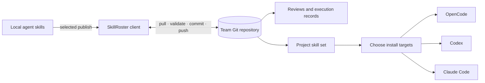

<p align="center">
  
</p>

<p align="center">
  <a href="./README.md">한국어</a> · <strong>English</strong>
</p>

<p align="center">
  <a href="https://github.com/orqan137/skillroster/actions/workflows/ci.yml"></a>
  
  
  
  
</p>

> A self-hosted, Git-backed roster for sharing team AI-agent skills, reviewing real usage, and assembling project-specific skill sets.

<p align="center">
  <a href="#quick-demo">Quick demo</a> ·
  <a href="./docs/GETTING_STARTED.en.md">Getting started</a> ·
  <a href="./docs/ARCHITECTURE.en.md">Architecture</a> ·
  <a href="./docs/REGISTRY_FORMAT.en.md">Registry format</a> ·
  <a href="https://youtu.be/ATZtox9RLIQ">Demo video</a>
</p>

SkillRoster keeps agent skills scattered across individual machines in a shared team Git repository. Teammates publish only what they choose, leave reviews after using a skill, and pin exact versions when assembling a project. The same release can then be installed for OpenCode, Codex, or Claude Code.

Prompts, source code, and credentials are not collected by default. The repository contains published `SKILL.md` files, explicitly selected attachments or reference locations, reviews, project selections, and minimal execution records.

<p align="center">
  
</p>

## At a glance

| Step | Action | Recorded result |
|---:|---|---|
| 1 | Discover local skills from Codex, OpenCode, Claude Code, or another folder | Name and description stay local while browsing |
| 2 | Publish a selected skill version | `SKILL.md`, chosen references, author, and Git history |
| 3 | Add author or peer reviews and project outcomes | Ratings, notes, execution status, and project adoption |
| 4 | Pin versions for a project and select install targets | Skill IDs and exact versions |

The ranking reflects this team's reviews and project history, not global marketplace popularity. All shared data remains ordinary Markdown, YAML, and JSON that can be inspected, diffed, blamed, and rolled back with Git.

## Quick demo

Requirements: Node.js 22+, pnpm 11+, and Git.

```bash
corepack enable
pnpm install
pnpm demo
```

The command creates an isolated temporary roster and opens `http://127.0.0.1:3211`. It contains three members, three skills, two projects, four reviews, and two execution records. The demo scans only `examples/skills`; it does not inspect your actual agent directories or production data.

See [Getting started](docs/GETTING_STARTED.en.md) to create a real roster or use the CLI.

## Product screens

These are captures from the running `pnpm demo` application, not design mockups.

<p align="center">
  
</p>

<p align="center">
  
</p>

<table>
  <tr>
    <td width="50%"></td>
    <td width="50%"></td>
  </tr>
  <tr>
    <td><b>Shared and local skills</b><br>See what has been published and what remains on this machine.</td>
    <td><b>Project setup</b><br>Compare tag fit and team reviews, then pin exact versions.</td>
  </tr>
</table>

<p align="center">
  
</p>

## Core features

- **Git-backed team roster:** start with one empty remote and keep the access controls your team already uses.
- **Explicit publishing:** publish `SKILL.md` by default; include a reference file only after selecting it deliberately.
- **Author and peer reviews:** show them separately and give peer feedback more weight in team rankings.
- **Project skill sets:** use technology tags and team reviews to choose exact skill versions.
- **Multiple install targets:** copy the same release into OpenCode, Codex, or Claude Code project paths.
- **Auditable changes:** inspect and restore skills, reviews, and projects through commits and diffs.
- **Project-repository link:** write the selected roster to `.skillroster/project.yaml` in a project's own Git repository.
- **Usage-aware ranking:** combine reviews, recency, project adoption, and OpenCode execution status.

## Agent support

| Capability | OpenCode | Codex | Claude Code |
|---|:---:|:---:|:---:|
| Default local-directory discovery | Yes | Yes | Yes |
| Publishing and team reviews | Yes | Yes | Yes |
| Project installation path | `.opencode/skills` | `.agents/skills` | `.claude/skills` |
| Automatic execution records | Yes | Planned | Planned |

Reviews, project composition, and Git history are agent-independent. Automatic execution records currently use OpenCode's stable plugin hook.

## Data boundary

| Stored in Git | Not stored by default |
|---|---|
| Published `SKILL.md` and exact release | Prompts and agent responses |
| References explicitly included by the user | Project source and file contents |
| Review score, note, and author | Environment variables and credentials |
| Project tags and pinned skill versions | Unselected neighboring files |
| Skill, project, session ID, and execution status | Verification-command output |
| Verification result and changed-file count | Git passwords and access tokens |

The execution-record schema accepts only `promptStored: false` and `sourceStored: false`. This is a data-format boundary, not a sandbox against a modified local plugin. Review changes before installing a skill or plugin.

## How it works



The dashboard and CLI operate on each teammate's local clone. A write follows `clean check → pull --rebase → write → validate the full snapshot → commit → push`. Failed writes roll back to their starting revision, and the UI reports success only after the push completes.

See [Architecture](docs/ARCHITECTURE.en.md) for the system boundary and [Registry format](docs/REGISTRY_FORMAT.en.md) for paths and schemas.

## CLI

The current release is a developer-oriented source distribution.

| Command | Purpose |
|---|---|
| `team init` | Initialize an empty remote as a team roster |
| `team join` | Clone an existing roster and register a teammate |
| `publish` | Publish a local skill and immutable release snapshot |
| `review` | Review a specific skill version |
| `project init` | Register a project and install OpenCode execution-record integration |
| `project add` | Pin a skill version to a project |
| `sync` | Install pinned skills for selected agents |
| `evidence flush` | Validate queued execution records and write them to Git |
| `rank` | Print the team skill ranking |
| `dashboard` | Run the local dashboard |
| `demo` | Run an isolated sample roster |

```bash
pnpm skillroster <command> --help
```

## Security boundary

- The dashboard is an unauthenticated local client and binds to `127.0.0.1` by default.
- Git remote access is the actual team authorization boundary; roles displayed in the roster are metadata.
- Published skills and project verification commands may execute locally. Inspect repository changes before running them.
- Any remote deployment needs an authentication proxy and explicit network restrictions.

See [SECURITY.md](SECURITY.md) for reporting and known limitations.

## Documentation

- [Getting started](docs/GETTING_STARTED.en.md)
- [Architecture](docs/ARCHITECTURE.en.md)
- [Registry format](docs/REGISTRY_FORMAT.en.md)
- [Contributing](CONTRIBUTING.en.md)
- [Governance](docs/GOVERNANCE.en.md)
- [Roadmap](docs/ROADMAP.en.md)
- [Open-source compliance](docs/OPEN_SOURCE_COMPLIANCE.en.md)
- [Brand guide](docs/BRAND.en.md)

## Project status

The latest tag is `v0.1.0`. `main` also contains unreleased work, including multiple agent install targets, project-repository linking, and CLI build fixes. [CHANGELOG.md](CHANGELOG.md) and the [roadmap](docs/ROADMAP.en.md) keep released and upcoming work separate.

Implemented today:

- [x] Create a roster or join an existing one
- [x] Discover Codex, OpenCode, Claude Code, and Agent Skills directories
- [x] Publish skills and collect author and peer reviews
- [x] Recommend and pin exact versions for projects
- [x] Install for OpenCode, Codex, and Claude Code
- [x] Handle Git conflicts, credentials, and dirty worktrees
- [x] Run CI on Windows, macOS, and Linux; build the Docker image
- [ ] Publish an npm-executable CLI and standalone binaries
- [ ] Add Codex and Claude Code execution-record adapters
- [ ] Add organization login and project-level authorization

## Contributing

Bug reports and feature proposals are welcome in [GitHub Issues](https://github.com/orqan137/skillroster/issues). Discuss changes to schemas, collection scope, Git writes, or command execution before implementation.

Read [CONTRIBUTING.en.md](CONTRIBUTING.en.md) for setup and pull-request rules. SkillRoster is licensed under Apache License 2.0.
