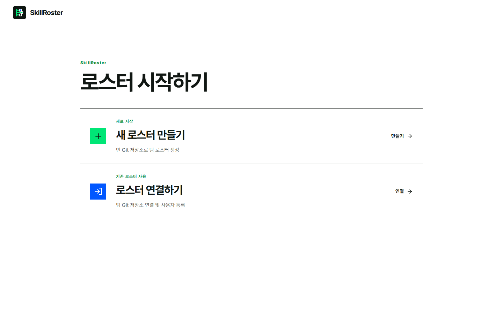
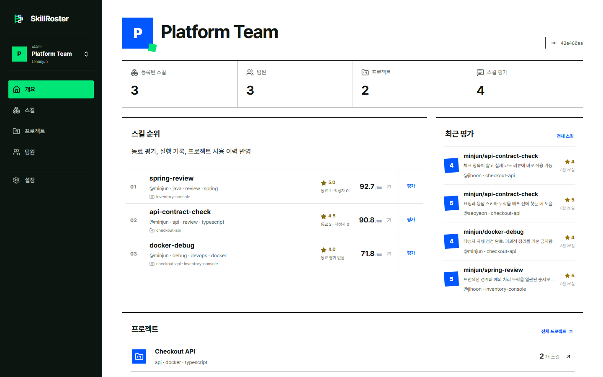
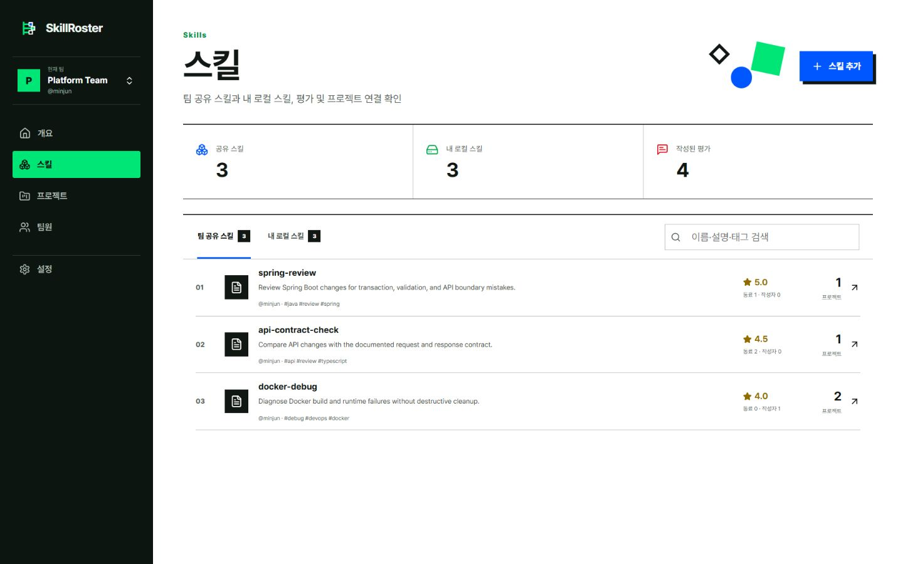
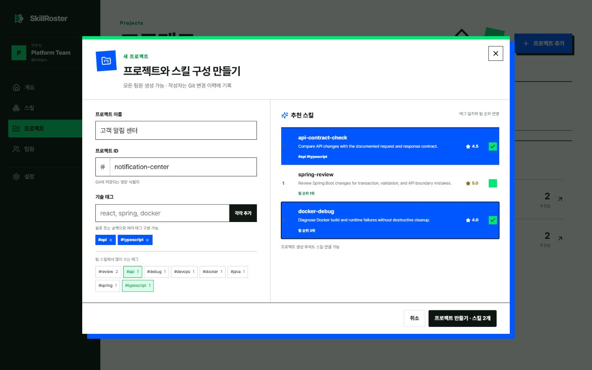
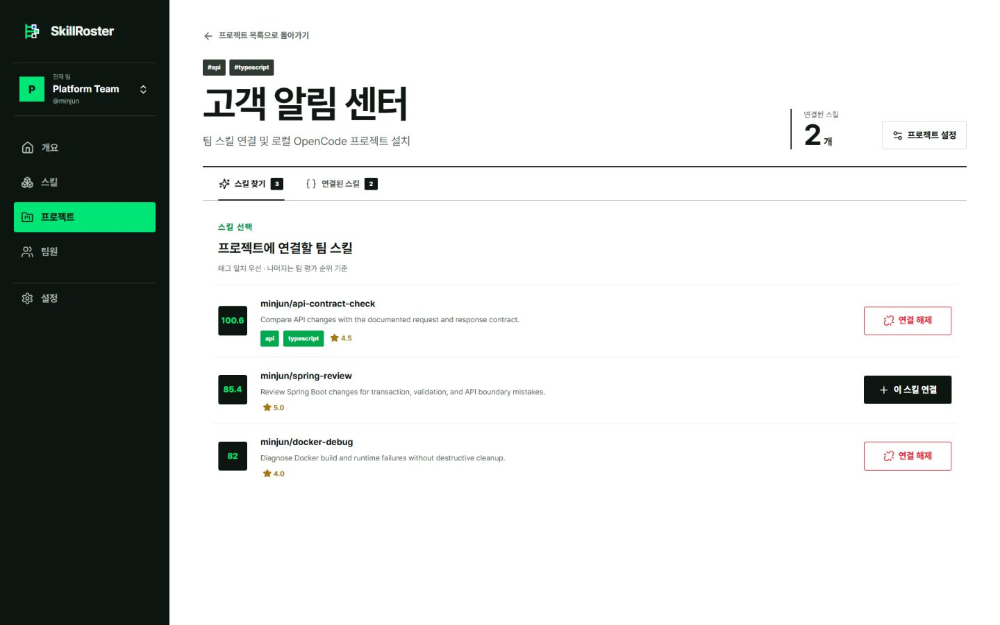
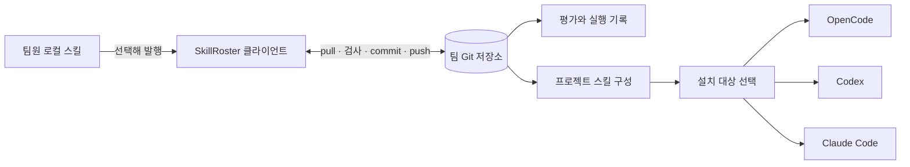

<p align="center">
  
</p>

<p align="center">
  <strong>한국어</strong> · <a href="./README.en.md">English</a>
</p>

<p align="center">
  <a href="https://github.com/orqan137/skillroster/actions/workflows/ci.yml"></a>
  
  
  
  
</p>

> 팀에서 쓰는 AI 에이전트 스킬을 Git에 모으고, 동료 평가와 사용 기록을 바탕으로 프로젝트별 구성을 만드는 자체 설치형 오픈소스 도구.

<p align="center">
  <a href="#빠르게-살펴보기">데모 실행</a> ·
  <a href="./docs/GETTING_STARTED.md">사용 안내</a> ·
  <a href="./docs/ARCHITECTURE.md">동작 구조</a> ·
  <a href="./docs/REGISTRY_FORMAT.md">저장 형식</a> ·
  <a href="https://youtu.be/ATZtox9RLIQ">시연 영상</a>
</p>

SkillRoster는 개인 컴퓨터에 흩어진 에이전트 스킬을 팀 Git 저장소에서 함께 관리합니다. 팀원은 필요한 스킬만 발행하고, 직접 사용한 결과와 의견을 남깁니다. 프로젝트를 만들 때는 기술 태그와 팀 평가를 참고해 사용할 스킬 버전을 고른 뒤 OpenCode·Codex·Claude Code 경로에 설치할 수 있습니다.

프롬프트, 소스 코드, 인증정보는 기본 수집 대상이 아닙니다. 발행한 `SKILL.md`, 사용자가 직접 고른 첨부 파일과 참고 위치, 평가, 프로젝트 구성, 최소한의 실행 기록만 Git에 남습니다.

<p align="center">
  
</p>

## 한눈에 보기

| 순서 | 하는 일 | 남는 기록 |
|---:|---|---|
| 1 | Codex·OpenCode·Claude Code 등의 로컬 스킬 폴더 탐색 | 이름과 설명을 로컬에서 확인 |
| 2 | 팀에 공유할 스킬 버전 발행 | `SKILL.md`, 선택한 참고 자료, 작성자와 Git 이력 |
| 3 | 작성자·동료 평가와 프로젝트 사용 결과 기록 | 평가, 후기, 실행 상태, 사용 프로젝트 |
| 4 | 프로젝트에 필요한 스킬을 골라 도구별 경로에 설치 | 선택한 스킬 ID와 정확한 버전 |

공개 마켓의 인기 순위 대신 같은 팀이 남긴 평가와 실제 프로젝트 사용 이력을 보여주는 것이 핵심입니다. 모든 자료는 일반 Markdown·YAML·JSON 문서로 저장되며, 변경 내용은 Git의 commit·diff·blame·rollback으로 확인할 수 있습니다.

## 빠르게 살펴보기

Node.js 22+, pnpm 11+, Git이 필요합니다.

```bash
corepack enable
pnpm install
pnpm demo
```

명령을 실행하면 외부 Git 계정 없이 임시 로스터가 만들어지고 `http://127.0.0.1:3211`이 열립니다. 데모에는 팀원 3명, 스킬 3개, 프로젝트 2개, 평가 4개, 실행 기록 2개가 들어 있습니다. `examples/skills`만 읽기 때문에 사용자의 실제 스킬 폴더나 운영 자료에는 접근하지 않습니다.

실제 로스터 생성과 CLI 사용법은 [시작하기](docs/GETTING_STARTED.md)에서 이어서 확인할 수 있습니다.

## 실제 화면

아래 이미지는 목업이 아니라 `pnpm demo`로 만든 임시 Git 로스터를 직접 조작해 캡처한 화면입니다.

<p align="center">
  
</p>

<p align="center"><b>처음 사용</b> · 팀장은 빈 원격 Git으로 로스터를 만들고, 팀원은 같은 저장소에 참여.</p>

<p align="center">
  
</p>

<table>
  <tr>
    <td width="50%"></td>
    <td width="50%"></td>
  </tr>
  <tr>
    <td><b>공유 스킬과 로컬 스킬</b><br>팀에 발행한 스킬과 이 컴퓨터에만 있는 스킬 구분.</td>
    <td><b>프로젝트 생성</b><br>기술 태그와 팀 평가를 함께 보고 사용할 버전 선택.</td>
  </tr>
</table>

<p align="center">
  
</p>

## 주요 기능

- **팀 Git 로스터**: 빈 Git 저장소 하나로 팀을 시작하고 기존 저장소 권한을 그대로 사용.
- **선택적 스킬 발행**: `SKILL.md`를 기본으로 발행하고, 참고 파일은 사용자가 직접 고른 경우에만 포함.
- **작성자 평가와 동료 평가**: 두 평가를 화면에서 구분하고 팀 순위에는 서로 다른 비중으로 반영.
- **프로젝트별 스킬 구성**: 기술 태그와 팀 평가를 참고해 정확한 스킬 버전을 추가하거나 제외.
- **도구별 설치**: 같은 버전을 OpenCode·Codex·Claude Code 프로젝트 경로에 복사.
- **Git 변경 이력**: 스킬·평가·프로젝트 문서를 commit과 diff로 검토하고 이전 상태로 복구.
- **프로젝트 Git 연결**: 선택한 스킬 목록을 프로젝트 저장소의 `.skillroster/project.yaml`에 기록.
- **실행 기록 기반 순위**: 동료 평가, 최근 사용, 프로젝트 채택, OpenCode 실행 상태를 함께 계산.

## 도구별 지원 범위

| 기능 | OpenCode | Codex | Claude Code |
|---|:---:|:---:|:---:|
| 기본 로컬 경로 탐색 | 지원 | 지원 | 지원 |
| 팀 스킬 발행과 평가 | 지원 | 지원 | 지원 |
| 프로젝트 경로에 설치 | `.opencode/skills` | `.agents/skills` | `.claude/skills` |
| 자동 실행 기록 | 지원 | 예정 | 예정 |

평가·프로젝트 구성·Git 이력은 특정 에이전트와 관계없이 사용할 수 있습니다. 자동 실행 기록만 현재 OpenCode의 안정화된 플러그인 훅을 사용합니다.

## 기록 범위

| Git에 기록함 | 기본적으로 기록하지 않음 |
|---|---|
| 발행한 `SKILL.md`와 정확한 버전 | 프롬프트와 에이전트 응답 |
| 사용자가 직접 포함한 참고 파일 | 프로젝트 소스 코드와 파일 내용 |
| 평가 점수, 후기, 작성자 | 환경 변수와 인증정보 |
| 프로젝트 태그와 선택한 스킬 | 선택하지 않은 이웃 파일과 폴더 |
| 스킬·프로젝트·세션 식별자, 실행 상태 | 검사 명령의 출력 내용 |
| 검사 통과 여부와 변경 파일 수 | Git 비밀번호와 접근 토큰 |

실행 기록 스키마는 `promptStored: false`, `sourceStored: false`만 허용합니다. 다만 로컬 플러그인을 변조한 경우까지 막는 보안 장치는 아니므로 설치할 스킬과 플러그인의 Git 변경 내용을 먼저 확인해야 합니다.

## 동작 방식



대시보드와 CLI는 각 팀원의 로컬 clone을 읽습니다. 내용을 저장할 때는 `작업 폴더 확인 → pull --rebase → 문서 작성 → 전체 문서 검사 → commit → push` 순서를 지킵니다. 중간에 실패하면 시작 시점으로 되돌리고, push가 끝난 뒤에만 저장 완료로 표시합니다.

자세한 구성은 [시스템 구조](docs/ARCHITECTURE.md), 파일 경로와 스키마는 [저장 형식](docs/REGISTRY_FORMAT.md)에서 확인할 수 있습니다.

## CLI

현재 배포물은 저장소에서 실행하는 개발자용 버전입니다. 주요 명령은 다음과 같습니다.

| 명령 | 역할 |
|---|---|
| `team init` | 빈 원격 Git 저장소를 팀 로스터로 초기화 |
| `team join` | 기존 로스터 clone과 팀원 정보 등록 |
| `publish` | 로컬 스킬과 변경되지 않는 버전 스냅샷 발행 |
| `review` | 특정 스킬 버전 평가 |
| `project init` | 프로젝트 등록과 OpenCode 실행 기록 연동 설치 |
| `project add` | 프로젝트에 사용할 스킬 버전 추가 |
| `sync` | 선택한 도구의 프로젝트 경로에 스킬 설치 |
| `evidence flush` | 대기 중인 실행 기록을 확인하고 팀 Git에 반영 |
| `rank` | 팀 스킬 순위 출력 |
| `dashboard` | 로컬 대시보드 실행 |
| `demo` | 임시 Git과 샘플 자료로 데모 실행 |

전체 옵션은 다음 명령으로 확인합니다.

```bash
pnpm skillroster <command> --help
```

CLI 빌드와 실제 팀 초기화·참여·발행 예시는 [시작하기](docs/GETTING_STARTED.md)에 정리되어 있습니다.

## 보안 경계

- 대시보드는 인증 기능이 없는 로컬 클라이언트이며 기본 주소는 `127.0.0.1`입니다.
- 팀 권한은 Git 원격 저장소의 접근 설정을 따릅니다. 화면의 팀 역할은 별도 권한 체계가 아닙니다.
- 프로젝트 검사 명령과 발행된 스킬은 로컬에서 실행될 수 있는 신뢰 대상입니다. 적용 전에 변경 내용을 확인해야 합니다.
- 외부 네트워크에 공개하려면 인증 프록시와 별도의 접근 제한이 필요합니다.

취약점 제보와 알려진 제한은 [보안 정책](SECURITY.md)을 참고하세요.

## 문서

- [시작하기](docs/GETTING_STARTED.md): 실제 로스터 생성, Git 인증, CLI, Docker
- [시스템 구조](docs/ARCHITECTURE.md): 로컬 실행, 팀 Git 저장소, 프로젝트 설치 흐름
- [저장 형식](docs/REGISTRY_FORMAT.md): 공개 YAML·JSON Schema와 복구 규칙
- [기여 안내](CONTRIBUTING.md): 개발 환경, Issue, PR, 검증 방법
- [프로젝트 운영](docs/GOVERNANCE.md): GitHub Flow, 역할, 릴리스 규칙
- [로드맵](docs/ROADMAP.md): 현재 개발본과 다음 단계
- [오픈소스 구성](docs/OPEN_SOURCE_COMPLIANCE.md): 사용 라이브러리와 라이선스 검사
- [브랜드 가이드](docs/BRAND.md): 로고, 마스코트, 색상, 생성 자산 기록

## 현재 상태

최신 태그는 `v0.1.0`입니다. `main`에는 다중 도구 설치, 프로젝트 Git 연결, CLI 빌드 보강 등 아직 새 태그로 배포하지 않은 변경이 포함되어 있습니다. 완료된 내용과 다음 릴리스 범위는 [CHANGELOG](CHANGELOG.md)와 [로드맵](docs/ROADMAP.md)에서 구분합니다.

현재 구현 범위:

- [x] 새 로스터 생성과 기존 로스터 참여
- [x] Codex·OpenCode·Claude Code·Agent Skills 경로 탐색
- [x] 스킬 발행, 작성자 평가, 동료 평가와 팀 순위
- [x] 프로젝트 태그 추천과 정확한 버전 연결
- [x] OpenCode·Codex·Claude Code 대상별 설치
- [x] Git 충돌·인증·작업 폴더 오류 처리
- [x] Windows·macOS·Linux CI와 Docker 빌드
- [ ] npm 실행형 CLI와 운영체제별 독립 실행 파일
- [ ] Codex·Claude Code 자동 실행 기록 연동
- [ ] 조직 로그인과 프로젝트별 세부 권한

## 기여하기

버그와 기능 제안은 [Issues](https://github.com/orqan137/skillroster/issues)에 남겨주세요. 저장 형식, 수집 범위, Git 쓰기 방식, 명령 실행 범위를 바꾸는 제안은 구현 전에 Issue에서 먼저 논의합니다.

개발 환경과 PR 규칙은 [기여 안내](CONTRIBUTING.md), 비공개 취약점 제보는 [보안 정책](SECURITY.md)에서 확인할 수 있습니다.

SkillRoster는 Apache License 2.0으로 배포합니다.
