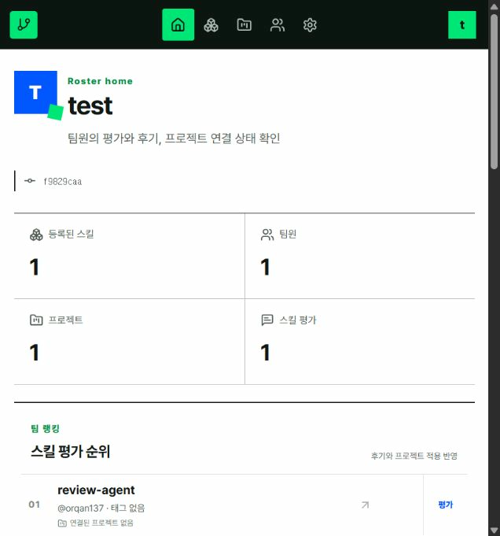
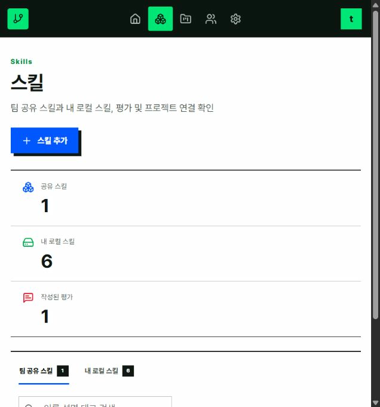
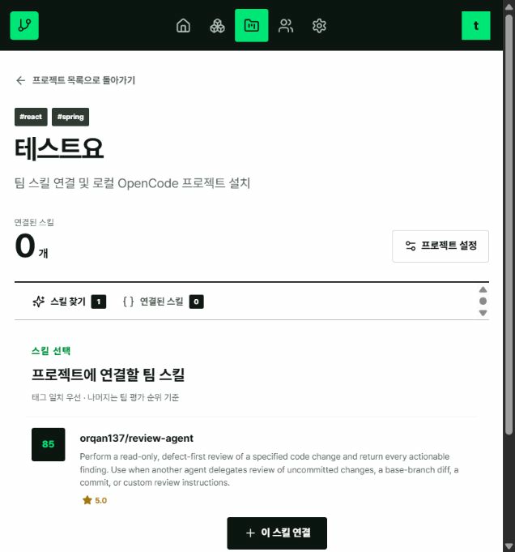
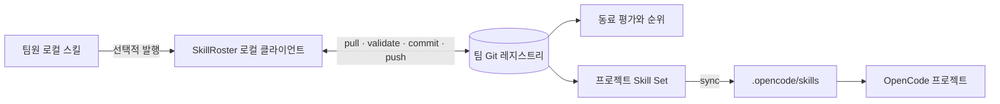

<p align="center">
  
</p>

<p align="center">
  <strong>한국어</strong> · <a href="./README.en.md">English</a>
</p>

<p align="center">
  <a href="https://github.com/orqan137/skillroster/actions/workflows/ci.yml"></a>
  
  
  
  
</p>

> 팀의 AI 에이전트 스킬을 Git으로 공유하고, 동료 평가와 프로젝트 적용 결과로 신뢰도를 판단하는 self-hosted 오픈소스 스킬 로스터.

SkillRoster는 팀원의 로컬 파일이나 프롬프트를 중앙 서버로 수집하지 않습니다. 사용자가 발행한 `SKILL.md`, 동료 리뷰, 프로젝트별 Skill Set, 최소한의 실행 근거만 일반 Git 저장소에 보관합니다. 각 팀원은 자기 clone을 통해 작업하고 OpenCode는 선택된 스킬을 `.opencode/skills/`에서 그대로 사용합니다.

<p align="center">
  
</p>

## 해결하려는 문제

AI 코딩 도구의 스킬은 대부분 개인 컴퓨터에 흩어져 있습니다. 좋은 스킬을 발견해도 어느 프로젝트에서 유효했는지, 지금도 믿을 수 있는지, 누가 사용해봤는지 팀원이 알기 어렵습니다. 파일 서버에 모두 모으면 인증정보와 개인 작업 상태가 섞이고, 공개 마켓의 다운로드 수는 우리 팀 환경에서의 품질을 설명하지 못합니다.

SkillRoster는 이 사이를 연결합니다.

| 질문 | SkillRoster의 답 |
|---|---|
| 팀에서 실제로 쓰는 스킬은 무엇인가? | 개인이 선택해 발행한 스킬과 버전을 한곳에서 탐색 |
| 어떤 스킬을 믿고 프로젝트에 넣을 수 있는가? | 동료 평가, 작성자 평가, 프로젝트 채택, 실행 근거를 분리해 표시 |
| 새 프로젝트에 어떤 스킬이 필요한가? | 기술 태그와 팀 평가 순위를 조합해 추천 |
| 누가 무엇을 바꿨는가? | YAML·Markdown 변경을 Git commit, diff, blame으로 추적 |
| 개인 프롬프트와 소스도 서버에 올라가는가? | 기본 비수집. 명시적으로 발행한 스킬 패키지만 공유 |

## 대표 화면

<p align="center">
  
</p>

<table>
  <tr>
    <td width="50%"></td>
    <td width="50%"></td>
  </tr>
  <tr>
    <td><b>팀 스킬과 내 로컬 스킬</b><br>발행된 스킬, 개인 저장소, 작성한 평가를 같은 화면에서 구분해 확인.</td>
    <td><b>프로젝트별 스킬 구성</b><br>태그 일치와 팀 평가 순위를 참고해 필요한 버전을 프로젝트에 연결.</td>
  </tr>
</table>

## 동작 방식



각 조직은 빈 원격 Git 저장소 하나로 로스터를 시작합니다. 팀원은 저장소 접근 권한과 자기 clone을 사용하며, 대시보드가 별도 데이터베이스 없이 Git 문서를 읽고 씁니다. 모든 변경은 전체 레지스트리 검증을 통과한 뒤 commit·push됩니다.

## 왜 다른가

- **팀 내부 레지스트리**: 공개 마켓의 다운로드 수가 아니라 우리 팀의 동료 평가와 프로젝트 재현 결과를 보여줍니다.
- **Git이 데이터베이스**: 별도 DB 없이 review, evidence, project loadout을 YAML과 Markdown으로 저장해 diff, blame, rollback이 가능합니다.
- **사람 평가 + 실행 근거**: 별점만으로 순위를 만들지 않습니다. 검증 성공·실패, 최근 활동, 실제 프로젝트 채택을 함께 반영합니다.
- **작성자 평가 구분**: 스킬을 공유하면서 자기평가를 남길 수 있지만, 화면에서 작성자 평가로 표시하고 순위에는 동료 평가의 35% 비중으로 반영합니다.
- **프로젝트 단위 장착**: 기술 태그로 필요한 스킬을 추천하고, 선택한 버전을 OpenCode 프로젝트에 설치합니다.
- **기본 비수집**: 프롬프트, 소스 코드, 인증정보를 evidence에 저장하지 않는 공개 스키마를 강제합니다.
- **도구 독립 규격**: 저장 형식은 OpenCode 밖에서도 읽을 수 있는 Markdown, YAML, JSON Schema입니다.

<table>
  <tr>
    <td width="220"></td>
    <td><b>Rovi · 로비</b><br>필요한 스킬을 프로젝트 로스터에 정리하는 보더콜리 팀 코치. 팀원을 감시하는 관리자가 아니라, 흩어진 도구를 구분하고 연결하는 SkillRoster의 역할을 나타냄. 로고·색상·사용 원칙은 <a href="./docs/BRAND.md">브랜드 가이드</a>에서 확인.</td>
  </tr>
</table>

## 2분 Quick start

요구 사항은 Node.js 22+, pnpm 11+, Git입니다.

원격 Git 저장소와 인증 없이 완성된 샘플부터 확인할 수 있습니다.

```bash
corepack enable
pnpm install
pnpm demo
```

3명의 팀원, 3개의 스킬, 평가, 프로젝트 연결, 검증된 실행 기록을 임시 로컬 Git에 만들고 `http://127.0.0.1:3211`에서 엽니다. 생성 경로는 terminal에 표시되며 운영 데이터에는 접근하지 않습니다.

직접 새 로스터를 구성하려면:

```bash
corepack enable
pnpm install
pnpm dev
```

브라우저에서 `http://127.0.0.1:3210`을 열면 최초 설정 화면이 나타납니다.

현재 저장소 실행 방식은 Windows, macOS, Linux에서 동일합니다. 사용자 홈과 파일 경로는 Node.js의 운영체제 API로 계산하므로 `C:\Users\...` 같은 Windows 경로나 `/Users/...` 같은 macOS 경로를 코드에 고정하지 않습니다. Windows에서는 PowerShell, macOS·Linux에서는 Terminal에서 위 명령을 실행하면 됩니다.

> 현재 MVP 배포물은 소스에서 실행하는 개발자용 클라이언트입니다. 일반 사용자가 저장소를 clone하지 않고 설치하게 하려면 릴리스 단계에서 컴파일된 대시보드를 포함한 npm CLI(`npx skillroster`) 또는 독립 실행 파일을 제공해야 합니다. 로컬 웹 UI + CLI 구조 자체는 그대로 유지할 수 있으며 Electron은 필수가 아닙니다.

첫 화면에서 역할에 맞는 흐름을 선택합니다.

- **새 로스터 만들기(팀장)**: README·라이선스 없이 만든 빈 GitHub/GitLab/Gitea 또는 사내 Git 저장소를 연결합니다. SkillRoster가 팀 구조를 생성하고 첫 커밋을 push합니다.
- **기존 로스터 들어가기(팀원)**: 팀장이 초기화한 원격 Git 주소를 연결합니다. SkillRoster가 저장소를 clone하고 내 팀원 정보를 커밋·push합니다.

두 흐름 모두 원격 Git 연결과 clone/push 권한이 필수입니다. 연결 후에는 이 컴퓨터에서 사용할 로컬 스킬 저장소를 선택합니다.

SkillRoster는 Git 비밀번호나 토큰을 별도로 저장하지 않습니다. Windows의 Git Credential Manager, macOS의 Keychain, 또는 사용자가 실행 중인 SSH Agent 등 각 컴퓨터의 Git 인증을 그대로 사용합니다. 저장소 주소를 입력하면 원격 저장소를 변경하지 않는 `git push --dry-run`으로 push 권한을 먼저 확인합니다. 인증이 없거나 만료되면 화면에서 다음 설정 방법을 안내합니다.

```bash
# GitHub CLI를 사용하는 경우
gh auth login

# SSH 키 연결을 확인하는 경우
ssh -T git@github.com
```

| 에이전트 | 기본 탐색 경로 |
|---|---|
| Codex | `~/.codex/skills` |
| OpenCode | `~/.config/opencode/skills` |
| Claude Code | `~/.claude/skills` |
| Agent Skills 공통 경로 | `~/.agents/skills` |

프로젝트 전용 `.opencode/skills`, `.claude/skills`, `.agents/skills` 경로도 직접 추가할 수 있습니다. 탐색기는 선택한 폴더 아래의 `SKILL.md`만 최대 4단계까지 찾고, 이름과 설명 메타데이터만 읽습니다. 소스 코드·인증정보·실행 프롬프트는 읽지 않으며, 발견된 로컬 스킬도 사용자가 직접 발행하기 전에는 팀 Git에 공유되지 않습니다.

설정이 끝나면 대시보드가 바로 열립니다. 팀 Git 저장소는 기본적으로
`~/.skillspace/teams/<team>`에 clone되고, 클라이언트 연결 정보는 `~/.skillspace/config.yaml`에
저장됩니다. 둘 다 일반 파일과 Git 저장소이므로 특정 SaaS에 종속되지 않습니다.

프로덕션 방식으로 로컬 실행하려면 다음 명령을 사용합니다.

```bash
pnpm build
pnpm start
```

CLI만으로도 동일한 초기화를 할 수 있습니다. 팀장이 빈 원격 Git 저장소를 준비한 뒤:

```bash
pnpm skillroster team init \
  --name backend \
  --display-name "Backend Guild" \
  --owner hong \
  --remote git@github.com:your-org/backend-skillroster.git
```

팀원은 같은 저장소에 연결합니다.

```bash
pnpm skillroster team join git@github.com:your-org/backend-skillroster.git \
  --member kim \
  --display-name "Kim"
```

스킬 발행, 프로젝트 등록, 추천 스킬 장착:

```bash
pnpm skillroster publish ./my-skill --version 1.0.0 --tags typescript,api

cd my-project
pnpm --dir ../skill-roster skillroster project init --name checkout-api
pnpm --dir ../skill-roster skillroster project add hong/api-contract-check
pnpm --dir ../skill-roster skillroster sync
```

`project init`은 다음을 함께 설치합니다.

- `.opencode/plugins/skillspace.js`: OpenCode의 `skill` tool 사용 이벤트 수집
- `.git/hooks/post-commit`: 커밋 후 검증 및 Git registry 반영
- `.skillspace/project.yaml`: 프로젝트 태그와 검증 명령

이미 CLI로 팀을 초기화했다면 시각화 클라이언트를 실행합니다.

```bash
pnpm skillroster dashboard
```

브라우저에서 팀 랭킹, 리뷰, 최근 검증 근거, 프로젝트별 추천과 Skill Set을 볼 수 있습니다. 기본 주소는 `http://127.0.0.1:3210`입니다.

## 주요 명령

| 명령 | 역할 |
|---|---|
| `team init` | 빈 Git remote를 팀 레지스트리로 초기화 |
| `team join` | 팀 clone 생성, 사용자 등록, 로컬 Git 신원 연결 |
| `publish` | 로컬 스킬과 불변 버전 snapshot 발행 |
| `review` | 다른 팀원의 특정 스킬 버전 평가 |
| `project init` | 기술 탐지, 프로젝트 등록, OpenCode/Git 연동 설치 |
| `project add` | 프로젝트 Skill Set에 특정 스킬 버전 추가 |
| `sync` | Skill Set을 `.opencode/skills`에 설치 |
| `evidence flush` | 대기 중인 사용 이벤트를 검증하고 Git에 반영 |
| `rank` | evidence-weighted 팀 순위 출력 |
| `dashboard` | 로컬 시각화 클라이언트 실행 |
| `demo` | 인증 없이 임시 Git과 샘플 대시보드 실행 |

전체 옵션은 `pnpm skillroster <command> --help`로 확인할 수 있습니다.

## 자동 평가가 의미하는 것

OpenCode가 설치된 팀 스킬을 불러오면 로컬 큐에는 아래 식별 정보만 기록됩니다.

- 스킬과 버전
- OpenCode session ID
- 사용 시각
- `promptStored: false`, `sourceStored: false`

다음 Git commit이 만들어지면 프로젝트에 명시된 검증 명령을 실행합니다. 성공은 `verified`, 실패는 `failed`, 검증 명령이 없으면 `used` evidence가 됩니다. 같은 세션에서 함께 사용한 스킬도 `coUsedSkills`로 기록됩니다. 검증 실패는 개발자의 커밋을 막지 않으며, 근거 상태로만 남습니다.

랭킹 점수는 Bayesian peer rating 65%, 실행 근거 20%, 최근성 10%, 프로젝트 채택 보너스로 구성됩니다. 새 스킬이 별점 하나만으로 1위를 독점하지 않도록 사전 평균을 적용합니다.

## Docker 대시보드

Docker Compose는 외부 인증 없는 MVP 대시보드를 localhost에만 바인딩합니다.

```bash
export SKILLSPACE_REGISTRY_HOST=/absolute/path/to/your/team-clone
export SKILLSPACE_MEMBER=kim
docker compose up --build
```

Windows PowerShell:

```powershell
$env:SKILLSPACE_REGISTRY_HOST = "C:\path\to\team-clone"
$env:SKILLSPACE_MEMBER = "kim"
docker compose up --build
```

## 저장소 구조

```text
apps/cli                  팀 init/join, 발행, 평가, 프로젝트, 대시보드 CLI
apps/web                  React + Vite 시각화 클라이언트와 Git write API
packages/core             파일 저장소, 기술 탐지, 추천·랭킹 알고리즘
packages/git              clone/pull/commit/rebase/push 트랜잭션
packages/opencode-plugin  OpenCode plugin과 기존 훅 보존형 Git hook 설치기
packages/schemas          공개 TypeScript 타입과 JSON Schema
examples                  데모 스킬과 프로젝트
docs                      아키텍처, 형식, 데모 문서
```

상세 설계는 [Architecture](docs/ARCHITECTURE.md), 공개 형식과 Git 트랜잭션 복구 원칙은 [Registry format](docs/REGISTRY_FORMAT.md), 발표 흐름은 [Demo](docs/DEMO.md)를 참고하세요. 대회 항목별 구현 증거는 [Contest scorecard](docs/CONTEST_SCORECARD.md), 운영 방식은 [Governance](docs/GOVERNANCE.md), 브랜드 자산은 [Brand guide](docs/BRAND.md), 의존성 근거는 [Open source compliance](docs/OPEN_SOURCE_COMPLIANCE.md)에 정리되어 있습니다.

## 현재 MVP 경계

- 대시보드는 개인 clone 위에서 실행하는 로컬 클라이언트입니다. 원격 팀 서비스로 공개하려면 조직 인증 프록시를 앞에 두어야 합니다.
- Git remote의 접근 제어가 팀 권한의 기준입니다. 세분화된 프로젝트 RBAC와 LDAP 연동은 후속 범위입니다.
- OpenCode stable plugin API를 기준으로 하며 V2 beta API에는 의존하지 않습니다.

## 프로젝트 상태와 로드맵

현재 `v0.1.0`은 해커톤 MVP이지만 핵심 흐름은 실제 Git 저장소에서 동작합니다.

- [x] 새 로스터 초기화와 기존 로스터 참여
- [x] Codex·OpenCode·Claude Code·Agent Skills 로컬 경로 탐색
- [x] 스킬 발행, 자기평가, 동료 평가와 팀 순위
- [x] 프로젝트 태그 추천, 버전 연결, `.opencode/skills` 설치
- [x] Git 충돌·인증·dirty worktree 오류 처리
- [x] Windows·macOS·Linux CI와 Docker 빌드
- [ ] 설치형 `npx skillroster` 배포와 독립 실행 파일
- [ ] GitHub/GitLab 조직 로그인 기반 관리자 화면
- [ ] Codex·Claude Code용 실행 근거 어댑터
- [ ] 프로젝트별 세분화 권한과 팀 레지스트리 보관 정책

버전별 수용 범위는 [Roadmap](docs/ROADMAP.md)에서 관리합니다.

## 참여하기

버그와 기능 제안은 [Issues](https://github.com/orqan137/skillroster/issues)에 남겨주세요. 저장 형식이나 보안 경계를 바꾸는 제안은 구현 전에 이슈에서 설계를 먼저 논의하면 좋습니다.

- 개발 환경과 PR 기준: [CONTRIBUTING.md](CONTRIBUTING.md)
- 보안 취약점 비공개 제보: [SECURITY.md](SECURITY.md)
- 저장 형식과 트랜잭션 원칙: [Registry format](docs/REGISTRY_FORMAT.md)
- 시스템 구조: [Architecture](docs/ARCHITECTURE.md)
- 배점별 재현 증거: [Contest scorecard](docs/CONTEST_SCORECARD.md)
- GitHub Flow와 release 정책: [Governance](docs/GOVERNANCE.md)
- OSS와 license 검증: [Open source compliance](docs/OPEN_SOURCE_COMPLIANCE.md)
- 로고·마스코트·대표 이미지: [Brand guide](docs/BRAND.md)

SkillRoster는 Apache License 2.0으로 배포합니다.
