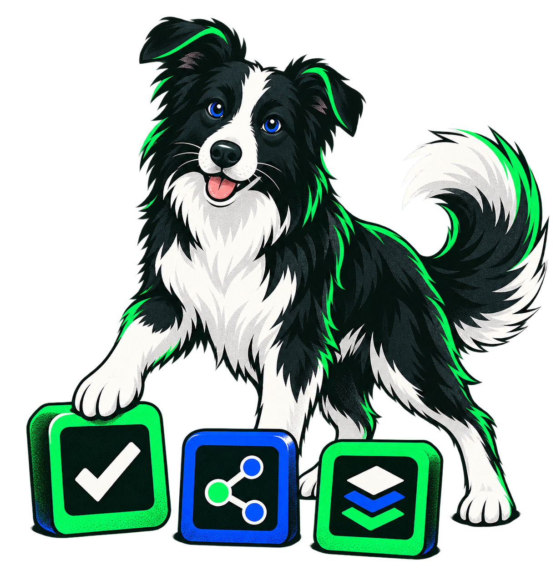
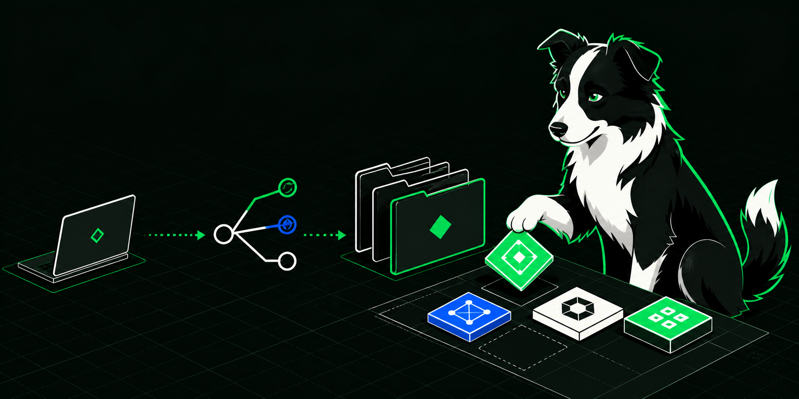

# SkillRoster 브랜드 가이드

**한국어** · [English](BRAND.en.md)

SkillRoster의 로고와 이미지는 **흩어진 팀 스킬을 한 로스터로 정리하고, 프로젝트에 맞는 조합을 만드는 도구**라는 역할을 표현함.

## 이름과 핵심 문장

- 제품명: `SkillRoster` — 띄어쓰기 없이 대문자 `S`, `R` 사용
- 한국어: `팀의 AI 에이전트 스킬을 평가하고 프로젝트에 연결하는 Git 기반 로스터`
- 영문: `A Git-backed team roster for reviewing AI-agent skills and assembling project-specific skill sets.`
- 피해야 할 표현: 검증을 보장한다는 표현, 팀원을 감시한다는 표현, 구현되지 않은 중앙 SaaS·SSO 기능

## 로고

| 자산 | 용도 |
|---|---|
| [`skillroster-mark.svg`](./brand/skillroster-mark.svg) | 앱 아이콘, 파비콘, 정사각형 프로필 |
| [`skillroster-wordmark.svg`](./brand/skillroster-wordmark.svg) | README, 발표 자료, 넓은 헤더 |

마크의 왼쪽 선은 Git 이력, 세 개 슬롯은 팀원이 공유한 스킬, 서로 다른 색의 타일은 프로젝트별 스킬 구성을 뜻함. 최소 표시 크기는 24px이며, 마크 주변에는 높이의 25% 이상 여백 권장.

로고 비율·색상·글자를 임의로 늘이거나, 그림자·그라데이션·외곽 효과를 추가하지 않음. 어두운 배경에서는 워드마크 글자색을 흰색으로 바꿀 수 있으나 마크 내부 색은 유지.

## 마스코트 — Rovi(로비)

  

로비는 필요한 스킬을 빠르게 구분하고 한 팀의 로스터로 정리하는 **보더콜리 팀 코치**임. 팀원을 통제하거나 감시하는 캐릭터가 아니라, 프로젝트에 맞는 도구를 정리하는 조력자로 표현함.

- 성격: 영리함, 차분함, 협업 지향
- 대표 동작: 스킬 타일 정리, 프로젝트 라인업 구성, 변경 이력 확인
- 금지: 공격적인 경비견 표현, 사람을 몰아가는 장면, 유아용 과장 표정
- 이름 유래: `Roster`의 `Ro`와 방향을 잡는 짧고 친근한 소리에서 만든 고유 이름

## 대표 이미지

  

대표 이미지는 로컬 스킬 → Git 레지스트리 → 프로젝트별 스킬 구성이라는 제품 흐름을 보여줌. GitHub README, 발표 표지, 프로젝트 소개 페이지에 사용 가능.

## 색상

| 이름 | 값 | 역할 |
|---|---|---|
| Roster Ink | `#0D1510` | 기본 배경, 본문 잉크 |
| Roster Green | `#00E676` | 선택, 연결, 핵심 동작 |
| Action Blue | `#0057FF` | 보조 동작, 링크, 비교 항목 |
| White | `#FFFFFF` | 어두운 배경 위 정보 |

그라데이션과 저채도 파스텔 대신 명확한 단색 대비 사용. 녹색은 장식보다 현재 선택·연결 상태를 나타내는 데 우선 사용.

## 생성 자산 기록

`rovi-mascot.png`와 `skillroster-hero.png`는 2026-08-26 OpenAI 이미지 생성 도구로 이 저장소를 위해 새로 제작함. 저장소 기여자는 Apache-2.0 범위에서 문서·홍보·파생 작업에 사용할 수 있음. `SkillRoster` 명칭에 대한 별도 상표권 등록을 주장하지 않음.

생성 지시의 핵심 조건은 다음과 같음.

- 검정·흰색 보더콜리 한 마리와 세 개의 기하학적 스킬 타일
- `#0D1510`, `#00E676`, `#0057FF`, 흰색만 사용한 고대비 편집 일러스트
- 텍스트·워터마크·기존 로고·사진 스타일 제외
- 마스코트는 투명 PNG, 대표 이미지는 2:1 가로형

외부 생성 자산을 추가할 때는 사용 도구, 생성일, 핵심 프롬프트, 라이선스 또는 이용 조건을 같은 방식으로 기록해야 함.
